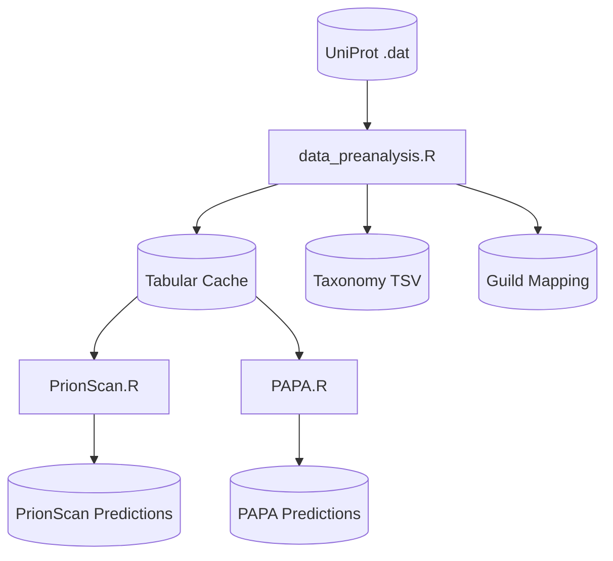

# Prion Prediction Pipeline

A comprehensive R-based pipeline for identifying prion-like domains in fungal proteomes. This pipeline analyzes UniProt fungi databases to predict proteins with prion-forming propensity using multiple complementary algorithms.

## Overview

The pipeline processes UniProt SwissProt/TrEMBL fungi databases through a series of analysis steps:

1. **Data Pre-Analysis** - Converts UniProt .dat files to tabular format, extracts taxonomy, and maps ecological guilds via FunGuild
2. **PrionScan** - Predicts Q/N-rich prion domains using probabilistic scoring (Espinosa Angarica algorithm)
3. **PAPA** - Prion Aggregation Prediction Algorithm with FoldIndex filtering (Toombs et al.)

## Requirements

### R Packages

```r
install.packages(c("tidyverse", "FUNGuildR", "patchwork", "optparse", "parallel", "readr", "stringr"))
```

### Optional (for diagram generation)

```bash
# For PNG export via mermaid.ink API
install.packages("base64enc")

# OR local CLI (no internet required)
npm install -g @mermaid-js/mermaid-cli
```

## Directory Structure

```
prion-prediction-pipeline/
├── R/                          # Analysis scripts
│   ├── pipeline.R              # Orchestrator (runs all steps)
│   ├── data_preanalysis.R      # Step 1: Data conversion & FunGuild
│   ├── PrionScan.R             # Step 2: Prion domain prediction
│   └── PAPA.R                  # Step 3: Aggregation propensity
├── data/
│   ├── raw/                    # Input: UniProt .dat files
│   ├── cache/                  # Intermediate: Tabular cache, FunGuild DB
│   └── processed/              # Output: Predictions, taxonomy, guild mapping
├── docs/                       # Documentation & changelogs
│   ├── workflow.md             # Full workflow description
│   └── changelog_*.md          # Version history per script
└── reports/                    # Pipeline run logs
```

## Quick Start

### 1. Download Input Data

Place UniProt fungi proteome files in `data/raw/`:

```bash
# Swiss-Prot (~50MB, curated)
wget -P data/raw/ https://ftp.uniprot.org/pub/databases/uniprot/current_release/knowledgebase/taxonomic_divisions/uniprot_sprot_fungi.dat.gz

# TrEMBL (~73GB, comprehensive)
wget -P data/raw/ https://ftp.uniprot.org/pub/databases/uniprot/current_release/knowledgebase/taxonomic_divisions/uniprot_trembl_fungi.dat.gz
```

### 2. Run Full Pipeline

```bash
# Process Swiss-Prot database (recommended for testing)
Rscript R/pipeline.R --db sprot

# Process TrEMBL database (large, requires significant time/memory)
Rscript R/pipeline.R --db trembl
```

### 3. Run Individual Steps

```bash
# Step 1: Data pre-analysis only
Rscript R/data_preanalysis.R --db sprot

# Step 2: PrionScan only (requires Step 1 cache)
Rscript R/PrionScan.R --db sprot

# Step 3: PAPA only (requires Step 1 cache)
Rscript R/PAPA.R --db sprot
```

## Pipeline Orchestrator

The `pipeline.R` script coordinates all analysis steps:

```bash
# Show available steps and status
Rscript R/pipeline.R --list --db sprot

# Dry-run (validate inputs without executing)
Rscript R/pipeline.R --check --db sprot

# Run specific step only
Rscript R/pipeline.R --db sprot --step PrionScan

# Export workflow diagram
Rscript R/pipeline.R --diagram
```

## Output Files

### From data_preanalysis.R

| File | Description |
|------|-------------|
| `*_fungi_tabular_*.tsv` | Cached protein data (ID, Organism, Taxonomy, TaxID, Sequence) |
| `*_fungi_taxonomy_*.tsv` | Protein taxonomy mapping |
| `*_genus_guild_mapping_*.tsv` | FunGuild ecological guild annotations |

### From PrionScan.R

| File | Description |
|------|-------------|
| `*_prion_predictions_*.tsv` | Prion domain predictions (Score >= 50) |

Columns: `Protein_ID, Organism, Window_Position, Score, Prion_Domain`

### From PAPA.R

| File | Description |
|------|-------------|
| `*_papa_predictions_*.tsv` | PAPA scores for all proteins |

Columns: `Protein_ID, Organism, PAPA_Score, PAPA_Position, Above_Threshold`

> **Note**: Taxonomy and NCBI_TaxID are stored in the tabular cache. Join by `Protein_ID` when needed.

## Workflow Diagram



## Algorithm Details

### PrionScan

- **Method**: Sliding window (60 aa) with amino acid propensity scoring
- **Threshold**: Score >= 50 for positive prediction
- **Reference**: Espinosa Angarica et al. (2013) BMC Genomics; Alberti et al. (2009) Cell

### PAPA

- **Method**: Prion propensity with FoldIndex disorder filtering
- **Window**: 41 aa (configurable)
- **Threshold**: Score >= 0.05 for potential prion-forming propensity
- **Reference**: Toombs et al. (2010) Mol Cell Biol 30(1):319-332

## Performance Notes

- **Tabular caching**: First run converts .dat to TSV (~4-5x faster). Subsequent runs use cache (~15-25x faster)
- **Parallel processing**: PrionScan and PAPA use all available cores by default (`--cores N` to customize)
- **Memory**: TrEMBL processing requires ~16GB+ RAM

## Documentation

See `docs/` for detailed documentation:

- `workflow.md` - Complete analysis workflow and tool descriptions
- `changelog_*.md` - Version history for each script

## License

GNU GPL v3+

## Citations

If you use this pipeline, please cite:

- **PrionScan algorithm**: Espinosa Angarica V, et al. (2013) "PrionScan: an online database of predicted prion domains in complete proteomes." BMC Genomics
- **PAPA algorithm**: Toombs JA, et al. (2010) "Compositional determinants of prion formation in yeast." Mol Cell Biol 30(1):319-332
- **FunGuild**: Nguyen NH, et al. (2016) "FUNGuild: An open annotation tool for parsing fungal community datasets by ecological guild." Fungal Ecology
