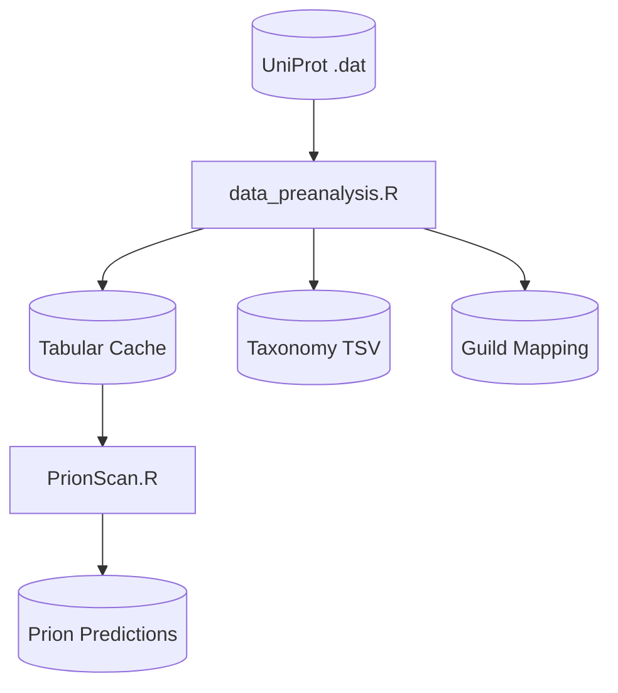

# Changelog - Pipeline Orchestrator

All notable changes to the Pipeline Orchestrator are documented in this file.

## [v1.3] - 2025

### PAPA Integration

- **NEW**: Added PAPA (Prion Aggregation Prediction Algorithm) as pipeline step
  - Registry entry: `PAPA`
  - Script path: `R/PAPA.R`
  - Output: `data/processed/{db}_papa_predictions_*.tsv`
- **Updated**: Step order now includes PAPA after PrionScan
- **Updated**: Mermaid diagrams show both PrionScan and PAPA in Step 2

### Pipeline Steps (v1.3)

1. **data_preanalysis**: Convert .dat to TSV, extract taxonomy, map FunGuild
2. **PrionScan**: Predict prion domains (Espinosa Angarica algorithm)
3. **PAPA**: Prion aggregation prediction (Toombs et al. algorithm)

---

## [v1.2] - 2025

### Script Rename

- **RENAMED**: `prion_parser` step renamed to `PrionScan`
  - Registry entry updated: `PrionScan` (was `prion_parser`)
  - Script path: `R/PrionScan.R` (was `R/prion_parser.R`)
  - Updated Mermaid diagram references

---

## [v1.1] - 2025

### Enhanced Diagram Export

- **NEW**: `--diagram` now exports files to `docs/` instead of just printing to console
  - Writes `docs/pipeline_diagram.md` (Mermaid code)
  - Generates `docs/pipeline_diagram.png` (rendered image)
- **PNG Generation**: Dual-method approach
  - Primary: mermaid.ink API (if internet available and base64enc package installed)
  - Fallback: mmdc CLI (if installed via `npm install -g @mermaid-js/mermaid-cli`)

---

## [v1.0] - 2025

Initial release of the pipeline orchestrator.

### Features

- **Registry-Based Architecture**: Each pipeline step defined with inputs, outputs, and dependencies
- **Dependency Resolution**: Automatically validates step dependencies before execution
- **Input/Output Tracking**: Validates file existence before running steps

### CLI Options

- `--db <sprot|trembl>`: Required database selection
- `--step <name>`: Run single step
- `--from <name>`: Run from step to end
- `--list`: Show available steps and status
- `--check`: Dry-run validation
- `--diagram`: Export workflow diagram to docs/

### Logging

- Timestamped run logs saved to `reports/pipeline_run_*.log`
- Console output mirrors log file

### Pipeline Steps

1. **data_preanalysis**: Convert .dat to TSV, extract taxonomy, map FunGuild
2. **PrionScan**: Predict prion domains from cached sequences

### Embedded Workflow Diagram

